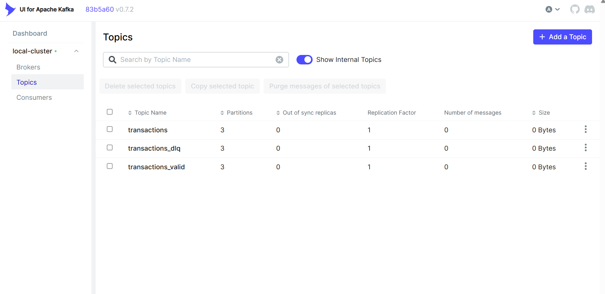
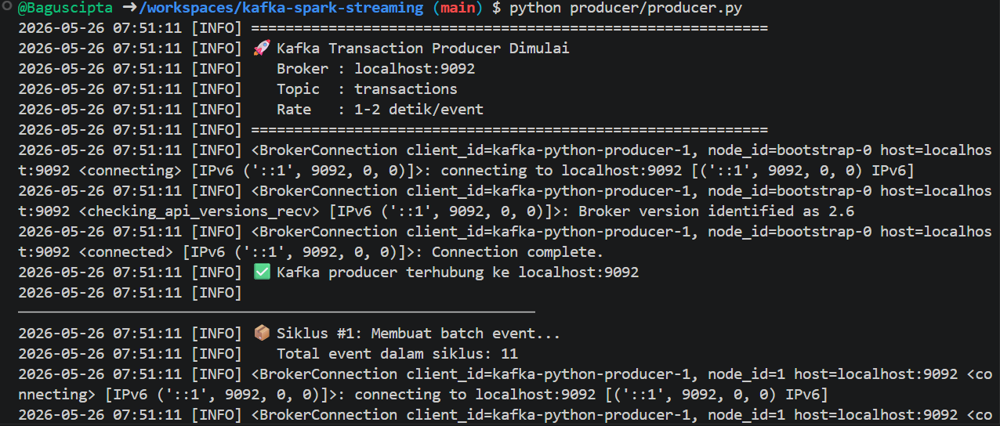
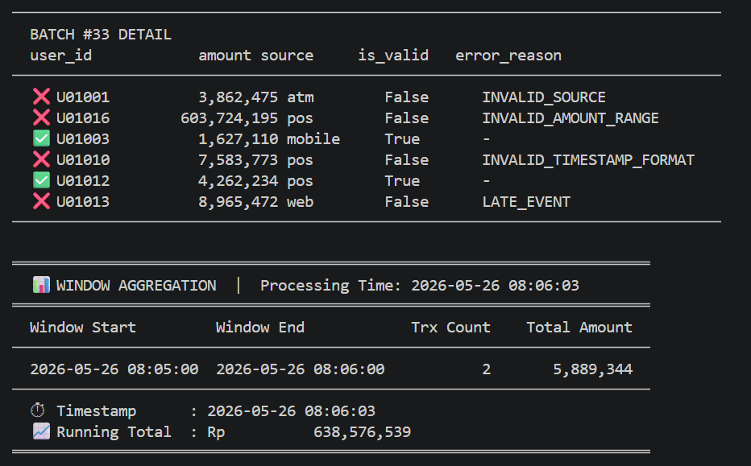

# 🚀 Real-Time Transaction Pipeline with Kafka & PySpark Streaming

[](https://www.python.org/)
[](https://kafka.apache.org/)
[](https://spark.apache.org/)
[](https://docs.docker.com/compose/)
[](LICENSE)

---

## 📌 Project Overview

Project ini adalah implementasi **Real-Time Data Pipeline** menggunakan **Apache Kafka** dan **PySpark Structured Streaming**. Pipeline ini mensimulasikan sistem pemrosesan transaksi keuangan secara real-time, lengkap dengan validasi data, deteksi duplikat, watermark handling, dan routing ke Dead Letter Queue (DLQ).

**Dibuat untuk:** Data Engineering Assignment — *Building Real-Time Data Pipelines with Kafka and Spark Streaming*

---

## 🏗️ Architecture

```
┌─────────────────────────────────────────────────────────────────────┐
│                     KAFKA + PYSPARK PIPELINE                        │
└─────────────────────────────────────────────────────────────────────┘

  ┌────────────┐    JSON Events     ┌──────────────────────┐
  │  Producer  │ ──────────────────▶│  Kafka Topic         │
  │ (Python)   │  1-2 det/event     │  [ transactions ]    │
  │            │                    └──────────┬───────────┘
  │ ✅ Valid   │                               │
  │ ❌ Invalid │                               │ readStream
  │ ⏰ Late    │                               ▼
  │ 🔁 Dupl.  │                    ┌──────────────────────┐
  └────────────┘                   │   PySpark            │
                                   │   Structured         │
                                   │   Streaming          │
                                   │                      │
                                   │  1. Parse JSON       │
                                   │  2. Validate         │
                                   │  3. Detect Late      │
                                   │  4. Detect Dupl.     │
                                   │  5. Watermark        │
                                   └──────────┬───────────┘
                                              │
                              ┌───────────────┴───────────────┐
                              │                               │
                              ▼                               ▼
                   ┌──────────────────┐           ┌──────────────────┐
                   │  transactions_   │           │  transactions_   │
                   │  valid           │           │  dlq             │
                   │                  │           │                  │
                   │  ✅ Valid events │           │  ❌ Invalid      │
                   │                  │           │  ⏰ Late         │
                   └──────────────────┘           │  🔁 Duplicate   │
                                                  └──────────────────┘
                              │
                              ▼
                   ┌──────────────────────────────┐
                   │   Console Window Output       │
                   │                              │
                   │  Tumbling Window (1 menit)   │
                   │  - timestamp                 │
                   │  - trx_count                 │
                   │  - total_amount              │
                   │  - running_total             │
                   └──────────────────────────────┘
```

---

## ✨ Features

| Feature | Description |
|---|---|
| 🎯 **Kafka Producer** | Generate transaksi valid, invalid, late, dan duplicate |
| 📋 **Explicit Schema** | Schema Spark didefinisikan eksplisit, bukan inferensi |
| ✅ **Multi-layer Validation** | 6 jenis validasi berbeda dengan error code spesifik |
| ⏰ **Watermark** | Late event > 3 menit dideteksi dan diroute ke DLQ |
| 🔁 **Duplicate Detection** | Deteksi duplikat berdasarkan user_id + timestamp |
| 🪣 **DLQ Routing** | Event invalid dikirim ke topic `transactions_dlq` |
| 📊 **Tumbling Window** | Agregasi per 1 menit dengan running total |
| 🐳 **Docker Ready** | Satu command untuk jalankan seluruh infrastructure |
| 🖥️ **Kafka UI** | Web interface di http://localhost:8080 |

---

## 🛠️ Tech Stack

| Komponen | Teknologi | Versi |
|---|---|---|
| Message Broker | Apache Kafka | 7.5.0 (Confluent) |
| Coordination | Apache ZooKeeper | 7.5.0 |
| Stream Processing | PySpark Structured Streaming | 3.5.0 |
| Language | Python | 3.10+ |
| Producer Library | kafka-python | 2.0.2 |
| Containerization | Docker Compose | v3.8 |
| Monitoring | Kafka UI (Provectus) | latest |

---

## 📁 Project Structure

```
kafka-spark-streaming/
│
├── docker-compose.yml          # Infrastructure: Kafka, ZooKeeper, Kafka UI
├── .env.example                # Template environment variables
├── Makefile                    # Shortcut commands
├── README.md                   # Dokumentasi ini
│
├── producer/
│   ├── producer.py             # Kafka producer dengan valid/invalid/late events
│   └── requirements.txt        # Python dependencies producer
│
├── streaming/
│   ├── spark_streaming_job.py  # PySpark streaming + validasi + routing
│   └── requirements.txt        # Python dependencies streaming
│
└── checkpoints/                # (Auto-generated) Spark checkpoint directory
    ├── main/
    └── ...
```

---

## ⚙️ Setup Instructions

### Prerequisites

Pastikan tools berikut terinstall:

```bash
# Cek Docker
docker --version        # >= 24.x
docker-compose --version  # >= 2.x

# Cek Python
python --version        # >= 3.10

# Cek Java (dibutuhkan PySpark)
java -version          # >= 11

# Cek Spark (untuk spark-submit)
spark-submit --version  # >= 3.5.0
```

> **Cara install Spark:** Download dari https://spark.apache.org/downloads.html
> Pilih **Spark 3.5.x** dengan **Hadoop 3.x**. Extract dan tambahkan ke PATH.

### 1. Clone & Setup

```bash
# Clone project
git clone https://github.com/username/kafka-spark-streaming.git
cd kafka-spark-streaming

# Copy environment file
cp .env.example .env
```

### 2. Install Python Dependencies

```bash
# Install dependencies producer
pip install -r producer/requirements.txt

# Install dependencies streaming
pip install -r streaming/requirements.txt
```

### 3. Jalankan Infrastructure

```bash
# Jalankan Kafka + ZooKeeper + Kafka UI
make up
# atau manual:
docker-compose up -d

# Tunggu hingga semua container healthy (~30 detik)
docker-compose ps
```

### 4. Cek Kafka Topics

Topic akan dibuat otomatis oleh service `kafka-init`. Verifikasi:

```bash
docker exec kafka kafka-topics --list --bootstrap-server localhost:9092
```

Output yang diharapkan:
```
transactions
transactions_dlq
transactions_valid
```

---

## ▶️ How to Run

### Terminal 1: Jalankan Producer

```bash
# Masuk ke folder producer
cd producer

# Jalankan producer
python producer.py
```

Producer akan mulai mengirim event setiap 1-2 detik. Output:
```
2025-12-14 09:00:20 [INFO] ✅ Kafka producer terhubung ke localhost:9092
2025-12-14 09:00:20 [INFO] ─────────────────────────────────────────────────
2025-12-14 09:00:20 [INFO] 📦 Siklus #1: Membuat batch event...
2025-12-14 09:00:21 [INFO] 📤 SENT | user=U01005   | amount=      350000 | source=mobile    | ts=2025-12-14T09:00:21Z
2025-12-14 09:00:23 [INFO] 📤 SENT | user=U01012   | amount=      -45000 | source=web      | ts=2025-12-14T09:00:23Z
```

### Terminal 2: Jalankan Spark Streaming Job

```bash
# Dari root directory project
spark-submit \
  --packages org.apache.spark:spark-sql-kafka-0-10_2.12:3.5.0 \
  --conf spark.ui.showConsoleProgress=false \
  streaming/spark_streaming_job.py

# atau menggunakan Makefile
make streaming
```

---

## 📊 Kafka Topics

| Topic | Purpose | Partitions |
|---|---|---|
| `transactions` | Raw input events dari producer | 3 |
| `transactions_valid` | Event yang lolos validasi | 3 |
| `transactions_dlq` | Event invalid, late, duplicate | 3 |

### Lihat isi topic dari terminal:

```bash
# Lihat transactions (raw input)
make consume-input

# Lihat valid events
make consume-valid

# Lihat DLQ events
make consume-dlq
```

---

## ✅ Validation Rules

Setiap event divalidasi dengan rules berikut:

| # | Rule | Error Code | Contoh |
|---|---|---|---|
| 1 | user_id tidak boleh null/kosong | `MISSING_USER_ID` | `"user_id": null` |
| 2 | amount tidak boleh null | `MISSING_AMOUNT` | field amount hilang |
| 3 | timestamp tidak boleh null/kosong | `MISSING_TIMESTAMP` | `"timestamp": ""` |
| 4 | timestamp harus format ISO 8601 | `INVALID_TIMESTAMP_FORMAT` | `"14-12-2025 09:00"` |
| 5 | amount harus antara 1 - 10.000.000 | `INVALID_AMOUNT_RANGE` | `-5000` atau `50000000` |
| 6 | source harus mobile/web/pos | `INVALID_SOURCE` | `"source": "atm"` |
| 7 | user_id + timestamp tidak boleh duplikat | `DUPLICATE_EVENT` | event sama dikirim 2x |
| 8 | event_time tidak boleh > 3 menit ke belakang | `LATE_EVENT` | timestamp 5 menit lalu |

### Kolom output validasi:

```json
{
  "user_id": "U01005",
  "amount": 350000,
  "timestamp": "2025-12-14T09:00:21Z",
  "source": "mobile",
  "event_time": "2025-12-14T09:00:21.000Z",
  "is_valid": true,
  "error_reason": null
}
```

```json
{
  "user_id": "U01012",
  "amount": -45000,
  "timestamp": "2025-12-14T09:00:23Z",
  "source": "web",
  "event_time": "2025-12-14T09:00:23.000Z",
  "is_valid": false,
  "error_reason": "INVALID_AMOUNT_RANGE"
}
```

---

## ⏰ Watermark Explanation

```python
watermarked_stream = stream.withWatermark("event_time", "3 minutes")
```

**Apa itu Watermark?**

Watermark adalah threshold yang menentukan **seberapa lama Spark menunggu late data** sebelum membuangnya dari state.

```
Timeline:
───────────────────────────────────────────────────────────▶ waktu
     │            │         │                  │
  event A      event B   event C (late)     event D
  09:00        09:02      09:00 (terlambat 2 mnt)  09:05

Max event_time yang terlihat = 09:05
Watermark threshold          = 3 menit
Batas watermark              = 09:05 - 3 menit = 09:02

event C (09:00) < batas watermark (09:02) → DIBUANG dari state
```

**Dampak dalam project ini:**
- Event dengan `event_time < max_seen_time - 3 menit` dianggap **LATE_EVENT**
- Late events dimasukkan ke `transactions_dlq`
- Window aggregation tidak akan menunggu selamanya untuk late data

---

## 🪟 Window Aggregation Explanation

```python
.groupBy(F.window(F.col("event_time"), "1 minute"))
.agg(F.count("*").alias("trx_count"), F.sum("amount").alias("total_amount"))
```

**Tumbling Window (Non-overlapping)**

```
Waktu:  09:00  09:01  09:02  09:03  09:04  09:05
         │──────│      │──────│      │──────│
         Window 1      Window 2      Window 3

Window 1: [09:00, 09:01) → hitung semua event di rentang ini
Window 2: [09:01, 09:02) → hitung semua event di rentang ini
Window 3: ...
```

**Setiap window menampilkan:**
- `window_start` - awal interval
- `window_end` - akhir interval
- `trx_count` - jumlah transaksi
- `total_amount` - total nilai transaksi
- `running_total` - akumulasi total sejak job dimulai

---

## 🪣 DLQ (Dead Letter Queue) Explanation

**Apa itu DLQ?**

Dead Letter Queue adalah pola arsitektur di mana event yang **gagal diproses** dikirim ke tempat terpisah (bukan dibuang), sehingga bisa dianalisis atau di-reprocess nanti.

**Dalam project ini:**

```
Producer ──▶ transactions ──▶ [Spark Validation]
                                      │
                         ┌────────────┴────────────┐
                         │                         │
                    is_valid = true           is_valid = false
                         │                         │
                         ▼                         ▼
               transactions_valid         transactions_dlq
               (siap diproses)            (perlu investigasi)
```

**Event yang masuk DLQ:**
- Amount di luar range (negatif atau > 10jt)
- Source tidak dikenal
- Format timestamp rusak
- Event terlambat lebih dari 3 menit
- Event duplikat

---

## 📄 Example Events

### Valid Event
```json
{"user_id": "U01005", "amount": 350000, "timestamp": "2025-12-14T09:00:21Z", "source": "mobile"}
```

### Invalid: Amount Negatif
```json
{"user_id": "U01012", "amount": -45000, "timestamp": "2025-12-14T09:00:23Z", "source": "web"}
```

### Invalid: Amount Terlalu Besar
```json
{"user_id": "U01008", "amount": 99999999, "timestamp": "2025-12-14T09:00:25Z", "source": "pos"}
```

### Invalid: Source Tidak Dikenal
```json
{"user_id": "U01003", "amount": 150000, "timestamp": "2025-12-14T09:00:27Z", "source": "atm"}
```

### Invalid: Timestamp Rusak
```json
{"user_id": "U01015", "amount": 200000, "timestamp": "14-12-2025 09:00:28", "source": "mobile"}
```

### Late Event (5 menit lalu)
```json
{"user_id": "U01009", "amount": 500000, "timestamp": "2025-12-14T08:55:00Z", "source": "web"}
```

### Duplicate Event (user_id + timestamp sama)
```json
{"user_id": "U01005", "amount": 350050, "timestamp": "2025-12-14T09:00:21Z", "source": "mobile"}
```

---

## 🖥️ Example Output

### Producer Output:
```
2025-12-14 09:00:20 [INFO] ════════════════════════════════════════════════════════════
2025-12-14 09:00:20 [INFO] 🚀 Kafka Transaction Producer Dimulai
2025-12-14 09:00:20 [INFO]    Broker : localhost:9092
2025-12-14 09:00:20 [INFO]    Topic  : transactions
2025-12-14 09:00:20 [INFO]    Rate   : 1-2 detik/event
2025-12-14 09:00:21 [INFO] 📤 SENT  | user=U01005     | amount=      350000 | source=mobile    | ts=2025-12-14T09:00:21Z | partition=0 offset=0
2025-12-14 09:00:23 [INFO] 📤 SENT  | user=U01012     | amount=       -45000 | source=web      | ts=2025-12-14T09:00:23Z | partition=1 offset=1
2025-12-14 09:00:25 [INFO] 📤 SENT  | user=U01008     | amount=    99999999 | source=pos       | ts=2025-12-14T09:00:25Z | partition=2 offset=2
```

### Spark Streaming Output (Batch Detail):
```
════════════════════════════════════════════════════════════════════════════════
  BATCH #3 DETAIL
  user_id      amount         source     is_valid   error_reason
────────────────────────────────────────────────────────────────────────────────
  ✅ U01005         350,000  mobile     True       -
  ❌ U01012         -45,000  web        False      INVALID_AMOUNT_RANGE
  ❌ U01008      99,999,999  pos        False      INVALID_AMOUNT_RANGE
  ❌ U01003         150,000  atm        False      INVALID_SOURCE
  ❌ U01015         200,000  mobile     False      INVALID_TIMESTAMP_FORMAT
  ❌ U01009         500,000  web        False      LATE_EVENT
  ❌ U01005         350,050  mobile     False      DUPLICATE_EVENT
  ✅ U01007       1,200,000  web        True       -
  ✅ U01002          75,000  pos        True       -
────────────────────────────────────────────────────────────────────────────────
```

### Spark Streaming Output (Window Aggregation):
```
════════════════════════════════════════════════════════════════════════════════
  📊 WINDOW AGGREGATION  |  Processing Time: 2025-12-14 09:01:00
════════════════════════════════════════════════════════════════════════════════
  Window Start         Window End           Trx Count    Total Amount
────────────────────────────────────────────────────────────────────────────────
  2025-12-14 09:00:00  2025-12-14 09:01:00          12       4,750,000
────────────────────────────────────────────────────────────────────────────────
  ⏱  Timestamp      : 2025-12-14 09:01:00
  📈 Running Total  : Rp                   4,750,000
════════════════════════════════════════════════════════════════════════════════
```

---

## 📸 Screenshots

> *Screenshot Kafka UI - Topic Overview*
> 

> *Screenshot Console - Producer Output*
> 

> *Screenshot Console - Streaming Job*
> 

---

## 🧪 Testing

### Test 1: Cek topic menerima pesan

```bash
# Consume dari topic transactions
docker exec kafka kafka-console-consumer \
  --bootstrap-server localhost:9092 \
  --topic transactions \
  --from-beginning \
  --max-messages 5
```

### Test 2: Cek valid events

```bash
docker exec kafka kafka-console-consumer \
  --bootstrap-server localhost:9092 \
  --topic transactions_valid \
  --from-beginning \
  --max-messages 5
```

### Test 3: Cek DLQ events

```bash
docker exec kafka kafka-console-consumer \
  --bootstrap-server localhost:9092 \
  --topic transactions_dlq \
  --from-beginning \
  --max-messages 5
```

### Test 4: Kirim manual event via console

```bash
# Kirim event valid
echo '{"user_id":"TEST001","amount":500000,"timestamp":"2025-12-14T09:00:00Z","source":"mobile"}' | \
  docker exec -i kafka kafka-console-producer \
  --bootstrap-server localhost:9092 \
  --topic transactions

# Kirim event invalid (amount negatif)
echo '{"user_id":"TEST002","amount":-1000,"timestamp":"2025-12-14T09:00:01Z","source":"mobile"}' | \
  docker exec -i kafka kafka-console-producer \
  --bootstrap-server localhost:9092 \
  --topic transactions
```

### Test 5: Verifikasi message count di setiap topic

```bash
# Count messages di transactions
docker exec kafka kafka-run-class kafka.tools.GetOffsetShell \
  --broker-list localhost:9092 \
  --topic transactions

# Count messages di transactions_valid
docker exec kafka kafka-run-class kafka.tools.GetOffsetShell \
  --broker-list localhost:9092 \
  --topic transactions_valid

# Count messages di transactions_dlq
docker exec kafka kafka-run-class kafka.tools.GetOffsetShell \
  --broker-list localhost:9092 \
  --topic transactions_dlq
```

---

## 🔧 Kafka Commands Reference

```bash
# List semua topics
docker exec kafka kafka-topics --list --bootstrap-server localhost:9092

# Describe topic (partisi, replika, dll)
docker exec kafka kafka-topics --describe --topic transactions --bootstrap-server localhost:9092

# Hapus topic (jika perlu reset)
docker exec kafka kafka-topics --delete --topic transactions --bootstrap-server localhost:9092

# Consumer group info
docker exec kafka kafka-consumer-groups --list --bootstrap-server localhost:9092
docker exec kafka kafka-consumer-groups --describe --group <group-id> --bootstrap-server localhost:9092
```

---

## 🚀 Future Improvements

| Area | Improvement |
|---|---|
| **Storage** | Sink valid events ke PostgreSQL atau Apache Iceberg |
| **Monitoring** | Integrasi Prometheus + Grafana untuk metrics |
| **Schema** | Gunakan Schema Registry (Confluent) untuk governance |
| **Deduplication** | Cross-batch deduplication menggunakan Redis |
| **ML** | Anomaly detection pada amount menggunakan Spark MLlib |
| **CI/CD** | GitHub Actions untuk test & deployment otomatis |
| **Testing** | Unit test untuk validation logic |
| **Retry** | Reprocessing event dari DLQ setelah perbaikan |
| **Scaling** | Multi-partition + multi-consumer group |

---

## 👨‍💻 Author

**[Nama Kamu]** — Data Engineer

- GitHub: [@username](https://github.com/username)
- LinkedIn: [linkedin.com/in/username](https://linkedin.com/in/username)

---

## 📄 License

MIT License — see [LICENSE](LICENSE) for details.
